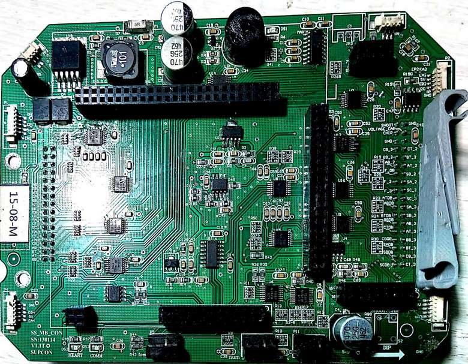
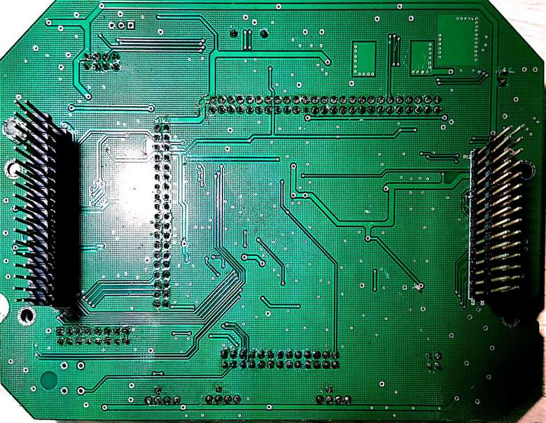

# ZJUNlict Mother Board Description
 
The mother board is used to convert between different logic levels (5V TTL <-> 3.3V TTL), improve signal quality and provide interface to the [motor driver board](https://github.com/ZJUNlict/Motor_Driver_Board), the [core board](https://github.com/ZJUNlict/Core_Board), the [nRF2401A](https://www.nordicsemi.com/eng/Products/2.4GHz-RF/nRF2401A) module, four [encoders](https://www.usdigital.com/) and a infrared sensor. (The board is designed using [Altium Designer](https://www.altium.com/altium-designer/) 17.1)

The main features are:

* Provide power supply (LM2576T-5.0 and TPS79401) for the core board and components on the mother board. (LiPo Battery 14.8-16.8V to 5V and 3.3V)
* Schmitt-trigger inverters (74LV14A, SN74HC14) complete the logic level convert and improve the signal quality.
* A/D (TLC0834) measures the battery and capacitor voltage.
* I/O expander (PCA9557PW) and rotary DIP switch (A6R/A6RV) for easier robot number, frequency and mode set.
* EEPROM (AT24C08) stores calibration data for each robot.
* Serial port (MAX232CSE) for communication with PC.

The photos of the mother board are shown below as references. 

